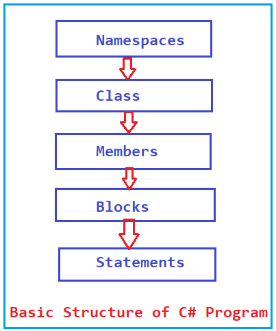

.. index::  program structure

.. _program-structure:

C# Program Structure
=====================

The .NET templates
----------------------

The .NET SDK comes with built-in templates for creating projects and files, including console apps, 
class libraries, unit test projects, etc. For learning purposes, we will mainly use the console app 
template. To see the list of templates, you may issue the ``dotnet new list`` command:

.. code-block:: console
   :emphasize-lines: 10

   PS C:\Users\tcn85> dotnet new list
   These templates matched your input:
   
   Template Name                                 Short Name                  Language    Tags
   --------------------------------------------  --------------------------  ----------  --------------------------
   ASP.NET Core Web App (Model-View-Controller)  mvc                         [C#],F#     Web/MVC
   ASP.NET Core Web App (Razor Pages)            webapp,razor                [C#]        Web/MVC/Razor Pages
   Blazor Web App                                blazor                      [C#]        Web/Blazor/WebAssembly
   Class Library                                 classlib                    [C#],F#,VB  Common/Library
   Console App                                   console                     [C#],F#,VB  Common/Console

We can try out the Console App template, which will give us a "Hello, World" message 
when executing. In the terminal, let us 
change directory (``cd``) into the test directory and issue command ``dotnet new console``. 
The .NET SDK will generate a project for us, which will include the following files and 
directories: 

#. The ``Program.cs`` file
#. The ``obj`` folder
#. The ``testPrj.csproj`` file
#. A ``bin`` directory will also be created later after the project is built.

.. code-block:: console
   :emphasize-lines: 9

   PS C:\Users\tcn85> cd test
   PS C:\Users\tcn85\test> ls                                                                                              PS C:\Users\tcn85> ls                                                                                              
   PS C:\Users\tcn85\test>                                                                                               PS C:\Users\tcn85> ls                                                                                              
   PS C:\Users\tcn85\test> dotnet new console
   The template "Console App" was created successfully.

   
   Processing post-creation actions...
   Restoring C:\Users\tcn85\test\test.csproj:
      Determining projects to restore...
      Restored C:\Users\tcn85\test\test.csproj (in 175 ms).
   Restore succeeded.
   
   PS C:\Users\tcn85\test> ls
      Directory: C:\Users\tcn85\test
      Mode                 LastWriteTime         Length Name
      ----                 -------------         ------ ----
      d-----          8/7/2024   2:54 PM                obj
      -a----          8/7/2024   2:54 PM            105 Program.cs
      -a----          8/7/2024   2:54 PM            252 test.csproj
      -a----         7/26/2024   5:06 PM              0 test.txt
      PS C:\Users\tcn85\test>

From the terminal we can open vscode by typing ``code .`` (the dot ``.`` means the current 
directory) and Enter.

.. code-block:: console

   PS C:\Users\tcn85\test> code .
   PS C:\Users\tcn85\test>

VS Code will open. We then choose the 
Explorer view and click on the Program.cs file. You will see that the Program.cs looks 
simple as below and we are working the executable code directly. 

.. code-block:: c#
   :linenos:

   // See https://aka.ms/new-console-template for more information
   Console.WriteLine("Hello, World!");

The template is very succinct because of a C# feature called "top-level statements", with 
which the compiler automatically performs some tasks such as: 

   - generates a Program class with an entry point method for the application; and 
   - adds a set of implicit ``global using`` directives such as Microsoft.NET.Sdk to include the most common namespaces. 
   

While this friendly to new users, as we learn more about C# programming, 
you will need to learn how to structure your code using namespaces and classes. 
To use the old program style, you can use the ``--use-program-main`` 
option to create a console app project with ``Main method``. In the example 
below, we first create a testPrj folder inside the test2 folder, then change into the 
testPrj folder, followed by issuing ``dotnet new console`` with the option ``--use-program-main``
to create a new console project:

.. code-block:: console

   tychen@mac:~/test/testPrj$ dotnet new console --use-program-main

This will give us the same project files as running dotnet new console without the "---program-main" 
option, but the Program.cs file will be different:

.. code-block:: console

   tychen@mac:~/test/testPrj$ ls
   Program.cs     obj            testPrj.csproj

The C# Program.cs file
-----------------------

Opening the Program.cs file created by ``dotnet new console --use-program-main`` 
and you see the template code as:

.. code-block:: c#
   :linenos:
   :emphasize-lines: 5

   namespace testPrj; 

   class Program
   {
      static void Main(string[] args)
      {
            Console.WriteLine("Hello, World!");
      }
   }

Some important concepts that you need to learn from this template code example 
here so we have better ideas about the basic structure of C# programs. 

#. ``using System;``:  

   Starting .NET 6, ``using System`` is implicit as defined in the ``.csproj`` file so 
   it is not shown in the Program.cs file. We should know that, ``System`` is a namespace 
   that contains basic defined value and reference types. The ``using`` directive, 
   allows you to use the types defined in a namespace without specifying the fully 
   qualified namespace of that type. For example, ``Console`` is a class inside the
   ``System`` namespace and we use the its ``WriteLine`` method to print to the console. 
   The following example would allow the use of the ``Text`` types such as the 
   System.Text.Ascii class and the nested namespace System.Text.Unicode:

   .. code-block:: 

      using System.Text;

#. ``namespace``: 
   The ``namespace`` keyword is used to declare a scope to organize types (such as classes). 
   For example, we may define a namespace as below 
   to contain unique **reference type** code elements. If you have some knowledge of 
   object-oriented programming (OOP), you probably have heard of that OOP programs consists of 
   classes. In the example below, you see the types (class, interface, struct, ...) are 
   under a namespace and the types are what we use to create functionalities for the application.  

   .. code-block:: 

      namespace SampleNamespace
      {
          class SampleClass { }
          interface ISampleInterface { }
          struct SampleStruct { }
          enum SampleEnum { a, b }
          delegate void SampleDelegate(int i);
          namespace Nested
          {
              class SampleClass2 { }
          }
      }

   An example of namespace is the ``System`` namespace in .NET. When we run 
   ``Console.WriteLine("Hello, World");``, we are actually running 
   ``System.Console.WriteLine("Hello World!");`` We do not specify "System" because it 
   is "imported" already and we can use the types within. The System namespace in 
   .NET contains classes classes that define commonly-used value and reference data types. 
   System engineers use namespace the same way to organize the functionalities in 
   applications. [#]_
   
#. ``class``:
   A class is a blueprint for creating objects, which may include the structure, 
   behaviors, and attributes of the objects. A class can be thought of a user-defined 
   data **type** (reference data type) containing 
   
   - attributes (data) and 
   - methods (actions applied to the data).  
  
   In principle, we design one type per file to make code navigation easy.  
  

#. The ``Main`` method:
   The **Main method** is the **entry point** of a C# application and therefore 
   the first method invoked when an application is executed. There is only one 
   entry point in a C# program. 

#. ``method``:
   A method (function) is an object-oriented term for function, which is a series 
   of statements designed to perform certain task. In C#, just like Java, the 
   *Main method* is the entry point of the program, meaning it is the first 
   method invoked when a program is executed. 

#. ``static`` & ``void``:
   The modifier ``static`` means the Main Method can be called without creating 
   a new object from the class. ``void`` means the Main method does not return anything. 

#. ``string[] args``:
   The ``args`` are called "command line arguments" and in this example the type is 
   string array; meaning when calling this method we send the arguments in and they 
   are zero-indexed as an array.  
   

Solutions and projects
-----------------------

The .NET platform uses *solutions* and *projects* to organize code items in specific structure. 
A solution is a container or workspace for one or more projects, and each project would 
contain source code files [#]_. A web app solution, for example, may include a website project, 
a database project, and a server-side API project; and each of the project will be named 
differently under different project folders inside the solution directory.

To create a solution as a workspace, we use the command ``dotnet new sln`` in the solution 
(or "workspace") directory. You then create all your project directories in the solution directory, 
and then use the ``dotnet new console`` command inside each of the project directories 
to create a console app project in each of the project directories. 

If you create a project in a folder using VS Code's "Create .NET Project" button in the Explorer view, 
a solution will be created with the same name as the project. To manage solutions, the Solution Explorer 
in VS Code can be used. To create a project without creating a solution, create a directory in command line 
and issue the command ``dotnet new console`` to create a new console app project without creating a new solution. [#]_ 

Comments, Curly Braces, and Semicolon
---------------------------------------

Comments are important as they make code more readable. C# offers single-line and multiple-line 
comments:

**Single-line Comments**: Single-line comments start with two forward slashes (//). Any text between // and the end of the line is ignored by C# (will not be executed).

**Multi-line Comments**: Multi-line comments start with /* and ends with \*/. Any text between /* and \*/ will be ignored by C#.

The **curly braces { }** in C# mark the beginning and the end of a block of code. 

**Semicolons** work as statement terminator character in C# and are required because they prevent syntax ambiguities. 
Semicolons after method or accessor block, however, is not allowed. 

Compound Statements (Code Blocks)
~~~~~~~~~~~~~~~~~~~~~~~~~~~~~~~~~~
A code block (or simply "block"), also referred to as a compound statement, is the grouping of multiple statements into a 
single statement. While each statement that ends with a semicolon, often it makes sense to see a block of 
statements as one lexical unit. In C#, a code block is delimited by a pair of curly braces to include 
a list of statements. For example, the following code shows an if statement, you can see the two highlighted 
code blocks being compound statements because the statements inside the curly braces. More specifically, 
line 4-9 is a compound statement of the if statement. 

.. code-block:: 
   :linenos:
   :emphasize-lines: 4-9, 11-14

   string temp = Console.ReadLine();
   radius = double.Parse(temp);
   if(radius >= 0)
   {
      // calculate the area of the circle
      area = Math.PI * radius * radius;
      Console.WriteLine(
         $"The area of the circle is: {area:0.00}");
   }
   else
   {
      Console.WriteLine(
         $"{radius} is not a valid radius.");
   }

.. rubric:: Footnotes
.. [#] Although a solution is not required for projects to execute, it offer some benefits such as project configuration and building all projects at once. 
.. [#] To learn more about the .NET System namespace, see the .NET API documentation at https://learn.microsoft.com/en-us/dotnet/api/system?view=net-8.0.  
.. [#] To manage .NET solutions and projects, see, for example, https://www.linkedin.com/pulse/managing-net-solution-files-dotnet-sln-sukhpinder-singh-arqvc/