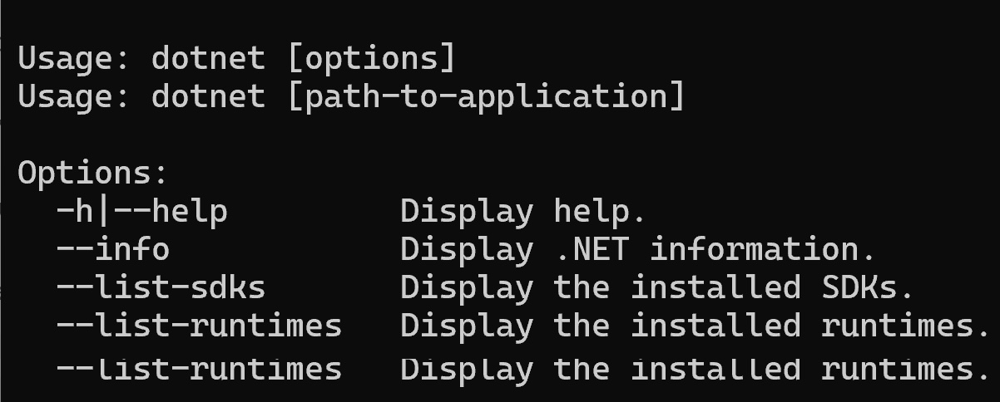

.. index:: development tools

.. _development-tools:

Development Tools 
===============================

The tools requred for this book include the .NET SDK, VS Code, and the C# extension 
(a VS Code extension). In addition, we will also use the command line interface 
(CLI, the Command Prompt in Windows or shell in macOS/Linux, or just "the terminal") 
for certain operations from time to time. 

Software Development Kits (SDKs)
--------------------------------------
A software development kit (SDK) is a collection of software development tools in one installable package. 
They facilitate the creation of applications by having a *compiler*, debugger and sometimes a software framework. 
SDKs are normally specific to a hardware platform and operating system combination. [#f1]_ [#f2]_ 

- *Runtime*: 
  
  As part of the .NET SDK, the .NET runtime is a virtual machine that converts the compiled intemedate code into macine code to be executed on the CPU. In addition, the .NET runtime provides an envrionment, that perfomrs services such as exception handling and garbage collection. 

Terminal & Shell
-----------------------------
Having some knowledge of using the command line interface (CLI, often referred to as command prompt in Windows, 
"shell" in Linux/macOS, or *command line*/*terminal* in general) is necessary when learning how to code. 
Major operting systems all have CLIs for users to interact with the 
operating system by issuing text commands in the terminal rather than using the graphical user interface 
(GUI). Differnt systems have different default terminal applications (or "terminal emulaters" as they emulate 
the locally-attached dumb terminals). 

- macOS: Terminal.app (Zsh, Bash)
- Linux: the shell (usually Bash) 
- Windows: Terminal (PowerShell, Command Prompt, Bash)

The terminal applications can run different (but work similarly) shells. 
For example: 
When we open a terminal applicatin, a default *shell* program is running as a command line interpreter program 
that takes commmads from users for execution in the operting system. For Windows, the default shell is 
PowerShell; for macOS it is the Z shell (Zsh); and Linux OS distributions, it is uaually the Bourne Again 
Shell (Bash). 

When you open the CLI application, you are working in a shell environment using the 
keyboard to issue commands rather than the poit-and-click devices with a GUI. In the terminal, 
you see a command prompt (``user_name@computer_name:~$`` for macOS/Linux or ``C:\Users\user_name>`` for Windows) followed by a 
cursor, which is where you issue your commands. To start navigating around the CLI environment, some 
of the essential commands include:

* ``ls`` (list storage) to show the files and directories in the current directory
* ``mkdir`` *dir* (make directory) to create a directory/folder called *dir*
* ``cd *path*`` (change directory) to change in the *path* directory in the directory tree structure \(path ".." means the upper level directory).
* ``^+C`` (hold the Control key and then hit the C key) to terminate a process.

In the command line, a file path is used to specify the location of a file in a 
computer's file system structure. The file system structure begins with the root, with 
some default first level directories built in. For example, the default location after 
logging in is the user's home directory, which can be specifed as /home/USER_NAME. Some 
special characters are commonly used for specifying path:

* ``/`` is the root of the system's file directory tree structure
* ``~`` is the user's home directory
* ``..`` means the directory one-level up of the current directory
* ``.`` means the current directory
  

VS Code
----------

Visual Studio Code (VS Code) is a editor with plenty of features. It has turned from a text 
editor into an integrated development editor (IDE) with a large number of
extensions available to enhance and enrich its tools and features. A great advantage of learning 
VS Code is that it is extremely versatile. Once you learn how to use it, you can use it for 
almost every other programming languages and technology as long as they involve editing and coding. <v>

Tools like VS Code play a central role in walking the programming workflow. For how to isntall VS Code, the .NET SDK, 
and C# Dev Kit, see :ref:`development-tools`. 

Install VS Code, .NET SDK, and C# Dev Kit Extension 
----------------------------------------------------

1. Install VS Code: Visit the Visual Studio Code 
   `website <https://code.visualstudio.com/Download>`_ or use a package manager to install the 
   current version of VS Code for your operating system. [#f3]_ 
   An `online version <https://vscode.dev>`_ of VS Code is also available. 

The VS Code user interface include several panes:
   
A. Activity Bar - Where you change Views. For example, the default view is Explorer and you click on the Extensions view to manage extensions. 
B. Primary Side Bar 
C. Editor
D. Panel
E. Status Bar

.. figure:: ../images/vscode_interface.jpg
   :scale: 50%

   Basic elements in VS Code user interface 

2. Install the .NET SDK: Visit VS Code's 
`.NET page <https://code.visualstudio.com/docs/languages/dotnet>`_ and scroll down to click 
on the "Install the .NET SDK" button. You will be redirected to the 
`.NET Download <https://dotnet.microsoft.com/en-us/download>`_ page, with OS,  
architect, and the recent long term support version of .NET SDK pre-seleted for you 
to start downlaoding.  

The download page also includes instructions for the installation and verification of the SDK. 
At the end of the installation, you should see a notification that the .NET SDK, along with 
.NET runtime, ASP.NET Core Runtime, and .NET Windows Desktop Runtime are installed. 

.. figure:: ../images/dotnet_sdk_installation.jpg
   :scale: 25%

To verify if .NET SDK is installed correctly, open a new terminal (e.g., PowerShell in Windows or Terminal in 
macOS) and run the ``dotnet`` command by type ``dotnet`` and then hit the Enter key. If .NET is correctly 
installed, you should see results as below.

   Outcome of running the ``dotnet`` command in terminal

3. Install the C# Dev Kit extension:
Click on the the Extension view icon on the Activity Bar, search and install the C# Dev Kit (this should 
also install the C# extension from Microsoft). 

.. 
   When the installation is completed, VS Code will prompt that "The .NET 

   Core SDK cannot be located:" in the lower right corner. Click on the "Get the SDK" button and 
   VS Code will ask to open the `external .NET website <https://dotnet.microsoft.com/en-us/download/dotnet/sdk-for-vs-code?utm_source=vs-code&amp;utm_medium=referral&amp;utm_campaign=sdk-install>`_. 
   Click on your SDK version to start downloading.

   .. figure:: ../images/dotnet_core_sdk_cannot_be_located.jpg
   :scale: 25%

.. In Windows, if you receive an error message as below while verifying, do the following:

.. #. Go to the Windows Taskbar and search for "envrionment variables". 
.. #. Choose "Edit the system environment variables" to open the System Properties window. 
.. #. Under the Advanced tab, click on the Environment Variables button to open the window.
.. #. Click on the Path variable in the User variables pane for *username* then the Edit button. 
.. #. The last entry in the opened Edit environment variable window should be something like *%ProgramFiles%\dotnet\*. 
.. #. For this environment variable, all Arm64 versions of .NET are installed to the normal C:\Program Files\dotnet\ folder. 
.. However, the x64 version of the .NET SDK is installed to the C:\Program Files\dotnet\x64\ folder.

.. .. figure:: ../images/dotnet_path_error.jpg
..    :scale: 25%

.. [#f1] See: Wikipedia Contributors. (2024, July 2). Software development kit. Wikipedia; Wikimedia Foundation. https://en.wikipedia.org/wiki/Software_development_kit
.. [#f2] The Microsoft .NET (".NET Core" before version 5) platform is an open-sourced cross-platform development platform. The .NET predecessor, ".NET Framework", on the other hand, is an SDK for developing software that runs primarily on Microsoft Windows. Wikipedia Contributors. (2024, July 1). .NET Framework. Wikipedia; Wikimedia Foundation. https://en.wikipedia.org/wiki/.NET_Framework
.. [#f3] For reasons such as handling versions, managing dependencies, and uninstallation, it is suggested that, when possible, you should use a package manager when installing software applications. Common used package managers incluce, e.g., `Homebrew <https://brew.sh/>`_ for macOS, `Chocolatey <https://chocolatey.org/>`_ for Windows, and apt/snap for Ubuntu Linux.