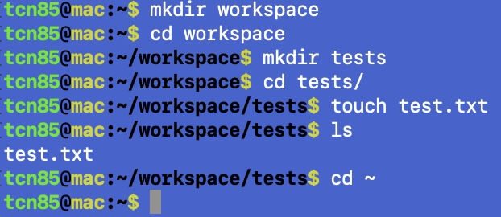
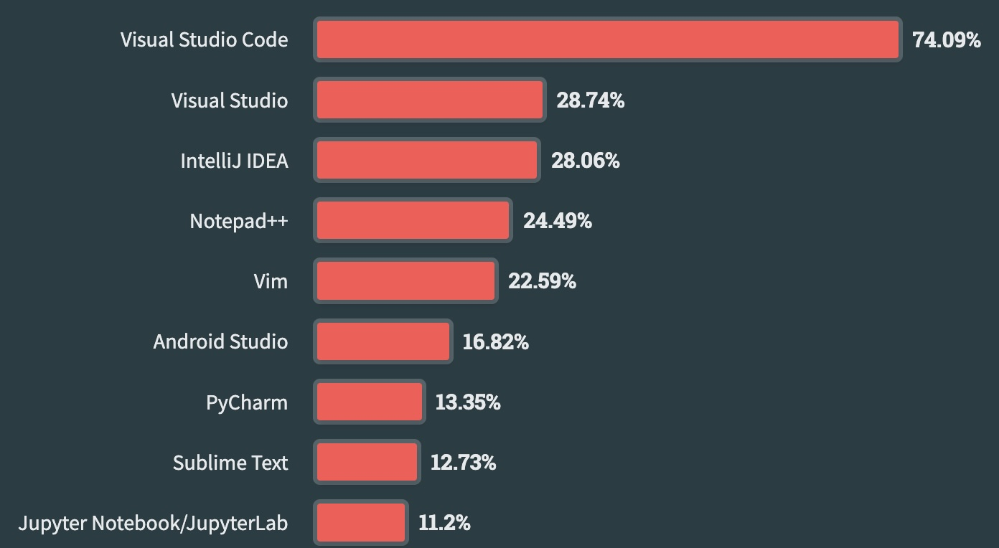

.. index:: development tools

.. _development-tools:

Development Tools 
===============================

The tools required for this book include the .NET SDK, VS Code, and the C# extension 
(a VS Code extension). In addition, we will also use the command line interface 
(CLI, the Command Prompt in Windows or shell in macOS/Linux, or just "the terminal") 
for certain operations from time to time. 

Software Development Kits (SDKs)
--------------------------------------
A software development kit (SDK) is a collection of software development tools in one installable package. 
They facilitate the creation of applications by having a *compiler*, debugger and sometimes a software framework. 
SDKs are normally specific to a hardware platform and operating system combination. [#f1]_ [#f2]_ 

- *Runtime*: 
  
  As part of the .NET SDK, the .NET runtime is a virtual machine that converts the compiled intermediate code into 
  machine code to be executed on the CPU. In addition, the .NET runtime provides an environment, that performs 
  services such as exception handling and garbage collection. 

Terminal & Shell
-----------------------------
Having some knowledge of using the command line interface (CLI, often referred to as command prompt in Windows, 
"shell" in Linux/macOS, or *command line*/*terminal* in general) is necessary when learning how to code. 
Major operating systems all have CLIs for users to interact with the 
operating system by issuing text commands in the terminal rather than using the graphical user interface 
(GUI). Different operating systems are shipped with different default terminal applications 
(or "terminal emulators" as they emulate the locally-attached dumb terminals). 

- macOS: Terminal.app (Zsh, Bash)
- Linux: the shell (usually Bash) 
- Windows: Terminal (PowerShell, Command Prompt, Bash)
 
When we open a terminal application, a default *shell* program is running as a command line interpreter program 
that takes commands from users for execution in the operating system. The terminal applications can run 
different shells and they work similarly. For Windows, the default shell is PowerShell; for macOS it is 
the Z shell (Zsh); and Linux OS distributions, it is usually the Bourne Again Shell (Bash). 

When you open the CLI application, you use  the keyboard (without a mouse) to issue text commands. In the terminal, 
you see a command prompt (``user_name@computer_name:~$`` for macOS/Linux or ``C:\Users\user_name>`` 
for Windows) followed by a cursor (maybe blinking), which is where you type to issue your commands. 

For Windows users, you may issue ``wsl`` to switch from the default PowerShell to Windows Subsystem for Linux (wsl) 
to use Bash as your shell. Your command prompt will change to ``user_name@computer_name:/mnt/c/Users/user_name$``. 
For the purpose of this book, you may use PowerShell and use the Bash commands with a slightly different interface.  

Unix-like OSs (such as Unix, macOS, and Linux) system are file-based, meaning the design principle dictates that 
everything in the system is a file, and the files are organized as a tree-like file system structure. In the 
command line, a *file path* is then used to specify the location of a file in a the computer's file system structure. 
The file system structure begins with the root (``/``), with a number of default first level directories representing the 
functionalities. For example, oen of the first the default location after logging in is the user's home directory, which is specified 
as /home/USER_NAME.

   .. figure:: ../images/linux_directory_tree.gif
      :scale: 70%

      A hypothetical Linux directory tree

To start navigating around the file system structure, some of the essential commands include:

  * ``ls`` (list storage) to show the files and directories in the current directory
  * ``pwd`` (present working directory) to see the full path of the current directory
  * ``mkdir`` *folder* (make directory) to create a new directory called *folder*
  * ``cd *path*`` (change directory) to change in the *path* directory in the directory tree structure \(path ".." means the upper level directory).
  * ``^+C`` (hold the Control key and then hit the C key) to terminate a process.
  * ``touch *filename*`` to create an empty file.
  * ``exit`` to exit out of the terminal app.

Some special pathname characters are commonly used for specifying paths:

* ``/`` is the root of the system's file directory tree structure
* ``~`` is the user's home directory
* ``..`` is the pathname of the directory one-level up of the current directory
* ``.`` means the current directory; but when placed at the beginning of a file, it makes the file a hidden file.

As an example, you may open your terminal app, create a directory called ``test`` in your home 
directory, then change into directory test, create a empty file called test.txt, and then change 
your location back to the home directory. The whole process should look similar to this in Windows:

.. code-block:: bash

   PS C:\Users\tcn85> mkdir workspace             ### create the workspace directory in user home directory
   PS C:\Users\tcn85> cd workspace                ### change directory into workspace
   PS C:\Users\tcn85\workspace> mkdir tests       ### create the tests directory
   PS C:\Users\tcn85\workspace> cd test           ### change into the test directory
   PS C:\Users\tcn85\workspace\tests> new-item test.txt   ### create an empty file; use "touch test.txt" if you use macOS. 
   PS C:\Users\tcn85\workspace\tests> ls          ### list storage to see the file
   test.txt
   PS C:\Users\tcn85\workspace\tests> cd ../..    ### change to the upper directory twice
   PS C:\Users\tcn85>

If you use macOS, the process should look similar enough:

    Creating a workspace directory, tests subdirectory, and a test file in macOS.

  

Integrated Development Environment (IDE)
-----------------------------------------

Integrated development environment (IDE) applications play a critical role in software development workflow and 
usually contains tools such as source-code editor, build automation tools, and a debugger. 
IDEs commonly used by professionals developers are: Visual Studio Code, Visual Studio, IntelliJ IDEA, Notepad++, and Vim.

Visual Studio Code (VS Code) is an editor with plenty of features. It has turned from a text 
editor into an integrated development editor (IDE) with a large number of
extensions available to enhance and enrich its tools and features. A great advantage of learning 
VS Code is that it is extremely versatile. Once you learn how to use it, you can use it for 
almost every other programming languages and technology as long as they involve editing and coding. 

   Visual Studio Code remains the preferred IDE across all developers. [#f]_

The popular IDE/editor VS Code user interface include several panes:   

A. Activity Bar - Where you change Views. For example, the default view is Explorer for managing files. 
B. Primary Side Bar 
C. Editor
D. Panel
E. Status Bar

**Activity Bar**: In the Activity Bar on the left of the window, you can access different 
Views such as:

#. Search - Provides global search and replace across your open folder.
#. Source Control - VS Code includes Git source control by default.
#. Run - VS Code's Run and Debug View displays variables, call stacks, and breakpoints.
#. Extensions - Install and manage your extensions within VS Code.
#. Custom views - Views contributed by extensions.

  .. figure:: ../images/vscode_interface.jpg
   :scale: 50%

   Basic elements in VS Code user interface [#]_

**Terminal**: In the Panel section, you have access to the TERMINAL and other console tabs. The Terminal 
is the same as your terminal application. When you open a project, the Terminal will be 
default to the project directory. You may use Cmd+J (Ctl+J) to toggle the Panel sometimes.  
 
**Command Palette**: In addition to the UI elements, an important key combination to learn is 
Ctrl + Shift + P on Windows and Linux, or Shift + Command + P on Mac. Command 
palette gives access to all the functionality within VS Code. For example, 
if you type ``.NET`` at the command palette, you get to access the .NET commands 
and features as follows.

.. figure:: ../images/command_pallette_dontnet.jpg
  :scale: 25%

Using vscode Command Palette
    

.. [#] See: Wikipedia Contributors. (2024, July 2). Software development kit. Wikipedia; Wikimedia Foundation. https://en.wikipedia.org/wiki/Software_development_kit
.. [#] The Microsoft .NET (".NET Core" before version 5) platform is an open-sourced cross-platform development platform. The .NET predecessor, ".NET Framework", on the other hand, is an SDK for developing software that runs primarily on Microsoft Windows. Wikipedia Contributors. (2024, July 1). .NET Framework. Wikipedia; Wikimedia Foundation. https://en.wikipedia.org/wiki/.NET_Framework
.. [#] StackOverflow Annual Developer Survey 2023. https://survey.stackoverflow.co/2023/#most-popular-technologies-new-collab-tools-prof
.. [#] For a comprehensive introduction to the interface of VS Code, see: https://code.visualstudio.com/docs/getstarted/userinterface