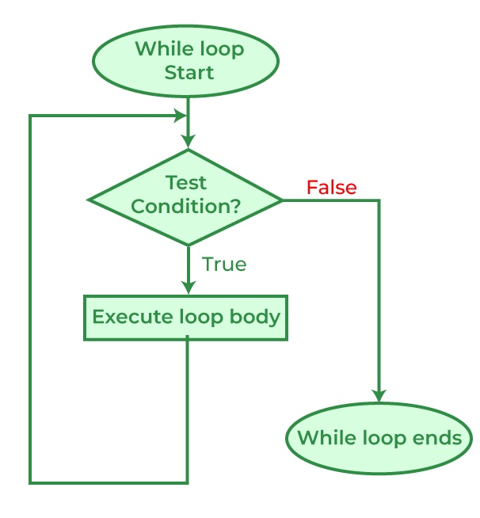

.. index:: 
   double: while; statement

.. _While-Statements:

While-Statements
============================ 

Just like the ``for`` loop, the while loop deals with iteration (*repetition* or *loops*). 
The ``while`` loop is **condition-controlled**, as opposing to ``for`` loop , which is 
**count-controlled**. This means a while loop runs a set of instructions continuously 
as long as the given **boolean condition** evaluates true, no matter how many loops it takes. 
Only when the condition is evaluated to NOT true, then the loop terminates. 

The flowchart of a while loop looks like the graph below, note that 
the sequential flow of a program is altered with the loops, just like with method calls
and conditional statements: [#flowchart-while-loop]_

For ``while`` loop, it is common to initialize a variable to be used in the 
condition, therefore the syntax would look like:

.. code-block:: 
   :linenos:
   :emphasize-lines: 1

   initialization 

   while ( *condition* )
   { 
         // statement(s)
         // iterator expression
   }

Note that, because the condition (boolean expression) is evaluated before each execution 
of the loop body (#4-6), a while loop can executes **zero** (if the condition 
evaluates to false immediately) or more times. 

You should test the following code, less the comments, in ``csharprepl`` to get familiar with 
the C# while loop::

   > int n = 0;                  // initialization

   > while (n < 5)               // conditional expression in the while loop header
      {                                                   
         Console.Write(n);       // body of while loop                                                                                      
         n++;                    // iterator (iterator expression)/update                                                                                      
      }                                                                                                                 
   01234
   > 

Note that this ``while`` loop code above is just the same as a ``for`` loop::

   > for (int i = 0; i < 5; i++)   
      {                                                                                           
         Console.Write(i);                                                                                             
      }                                                                                                                 
   01234

Both code have ``initializer``, ``conditional expression``, and ``iterator expression`` 
( see :ref:`for-loop-header`); except that in ``for loop``, the three sections are 
placed together in the header, while they are placed in different locations in 
the ``while`` loop.  

**Stepping**

Test yourself: Follow the code below to figure out what is printed:

.. code-block:: 
   :linenos:

   int i = 4;
   while (i < 9) 
   {
      Console.WriteLine(i);
      i = i + 2;
   }

Compare the preceding code to the code loop below:

.. code-block:: 
   :linenos:

   > int i = 4; while (i < 9)       
     {                
         i = i + 2; 
         Console.WriteLine(i);  
     } 

Do they produce the same result? Now, compare the preceding code with the following:

.. code-block::
   :linenos:

   > for (int i = 4; i < 9; i += 2)   
     {                          
         Console.WriteLine(i); 
     }

Make sure you are able to interpret the code correctly and type them in csharprepl or 
VS Code to test them out. 

Infinite loops
~~~~~~~~~~~~~~~~

Just like :ref:`for-statement`, manipulating the header sections will 
change the behavior of the loop. Test the following code in your ``csharprepl`` and be ready 
to issue ``Control + C`` to terminate the process::

   > int n = 0;
   > while (n < 5)           
   { 
      Console.Write(n); 
   }   
   000000000000000000000000000000...

Observing the code, you see that the variable ``n`` is not being updated in the body 
of the while loop. Since ``n`` is not updated, the value stays as 0, and the boolean 
condition ``(n < 5>)`` is always evaluated to be ``true``, an infinite loop is therefore 
formed since (n < 5) will stay true and, while the boolean condition is tested true, the 
body of the while loop will be executed and print out ``n``. 

If you want the while loop body of the while statement to run at least once, the boolean 
condition has to be true for the first evaluation. After that, the iterator (e.g., n++) 
in the body of the while statement needs to work to exit the loop by making the condition 
section untrue. The preceding code does not have an iterator expression and therefore 
the loop becomes infinite. 

For your possible interest, you may want to test the following ``for`` statement. Again, 
be ready to issue ``Control + C`` to terminate the process::

   > for (int i = 0; i < 5;) 
     { 
         Console.Write(i); 
     }   
   
After testing the code above, you should get better idea about how boolean expressions 
controls the code execution in loop.

**while (true)**

As an exercise, observe the following code. You should be able to see that the condition 
section has a value of ``true`` instead of an expression and reason the outcome of the 
code::

   > while (true) 
     { 
         Console.Write(0); 
     }

An infinite loop can happen when: 

#. The loop has no terminating condition.
#. The loop has a terminating condition that cannot be met.

An embedded system such as a cartridge-based video game console typically does not 
have an ``exit`` condition and the loop runs until the console is powered off. The 
same infinite loop design can be seen in operating systems or web servers, where the 
systems keep monitor input and give output and do not halt until crash, turned off, 
or reset. 

.. rubric:: Footnotes

.. [#flowchart-while-loop] The flowchart is from `geeksforgeeks.org <https://www.geeksforgeeks.org/c-while-loop/#>`_