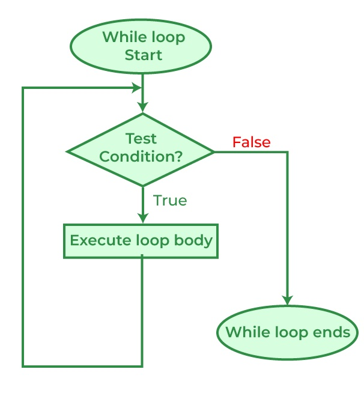

.. index:: 
   double: while; statement

.. _While-Statements:

While-Statements
============================ 

Just like the ``for`` loops, the while loops deal with iteration (*repetition* or *loops*). 
The ``while`` loop is **condition-controlled**, as opposing to ``for`` loop , which is 
**count-controlled**. This means a while loop runs a set of instructions continuously 
as long as the given **boolean condition** evaluates true, no matter how many loops it takes. 
Only when the condition is evaluated to NOT true, then the loop terminates. 

The flowchart of a while loop looks like the graph below, note that 
the sequential flow of a program is altered with the loops, just like with method calls
and conditional statements: [#flowchart-while-loop]_

The while loop, however, starts with an initialization of the variable to be used in the 
boolean condition, therefore the syntax would look like:

.. code-block:: 
   :linenos:
   :emphasize-lines: 1

   initialization 

   while ( *condition* )
   { 
         // statement(s)
         // iterator expression
   }

It is common to initialize a variable (#1) to be used in the condition (#3). Now, because 
that condition (boolean expression) is evaluated before each execution of the loop body (#4-6), 
a while loop can executes **zero** (if the condition evaluates to false immediately) or 
more times. 

You should test the following code, less the comments, in ``csharprepl`` to get familiar with 
the C# while loop::

   > int n = 0;                  // initialization

   > while (n < 5)               // conditional expression in the while loop header
      {                                                   
         Console.Write(n);       // body of while loop                                                                                      
         n++;                    // iterator (iterator expression)/update                                                                                      
      }                                                                                                                 
   01234
   > 

Note that this ``while`` loop code above is just the same as a ``for`` loop::

   > for (int i = 0; i < 5; i++)   
      {                                                                                           
         Console.Write(i);                                                                                             
      }                                                                                                                 
   01234

Both code have ``initializer``, ``conditional expression``, and ``iterator expression`` 
( see :ref:`for-loop-header`), except that in ``for loop``, the three sections are 
placed together in the header, while they are placed in different locations in the ``while`` loop.  

Stepping
~~~~~~~~~~

Test yourself: Follow the code. Figure out what is printed:

.. code-block:: 
   :linenos:

   int i = 4;
   while (i < 9) 
   {
      Console.WriteLine(i);
      i = i + 2;
   }

Infinite loops
~~~~~~~~~~~~~~~~

Just like :ref:`for-statement`, manipulating the header sections will 
change the behavior of the loop. Test the following code in your ``csharprepl`` and be ready 
to issue ``Control + C`` to terminate the process::

   > int n = 0;
   > while (n < 5)           
   { 
      Console.Write(n); 
   }   
   000000000000000000000000000000...

Observing the code, you see that the variable ``n`` is not being updated in the body 
of the while loop. Since ``n`` is not updated, the value stays as 0, and the boolean 
condition ``(n < 5>)`` is always evaluated to be ``true``, an infinite loop is therefore 
formed since (n < 5) will stay true and, while the boolean condition is tested true, the 
body of the while loop will be executed and print out ``n``. 

If you want the while loop body of the while statement to run at least once, the boolean 
condition has to be true for the first evaluation. After that, the iterator (e.g., n++) 
in the body of the while statement needs to work to exit the loop by making the condition 
section untrue. The preceding code does not have an iterator expression and therefore 
the loop becomes infinite. 

For your possible interest, you may want to test the following ``for`` statement. Again, 
be ready to issue ``Control + C`` to terminate the process::

   > for (int i = 0; i < 5;) 
     { 
         Console.Write(i); 
     }   
   
After testing the code above, you should get better idea about how boolean expressions 
controls the code execution in loop.

**while (true)**

As an exercise, observe the following code. You should be able to see that the condition 
section has a value of ``true`` instead of an expression and reason the outcome of the 
code::

   > while (true) 
     { 
         Console.Write(0); 
     }

An infinite loop can happen when: 

#. The loop has no terminating condition.
#. The loop has a terminating condition that cannot be met.

An embedded system such as a cartridge-based video game console typically does not 
have an ``exit`` condition and the loop runs until the console is powered off. The 
same infinite loop design can be seen in operating systems or web servers, where the 
systems keep monitor input and give output and do not halt until crash, turned off, 
or reset. 

.. index:: playing computer; loop

The Tea Temperature Example
-----------------------------

To make things concrete and numerical, suppose the following: The
tea starts at 115 degrees Fahrenheit. You want it at 112 degrees. A
chip of ice turns out to lower the temperature one degree each
time. You test the temperature each time, and also print out the
temperature before reducing the temperature. In C# you could
write and run the code below, saved in example program 
:repsrc:`cool/cool.cs`:

.. literalinclude:: ../../examples/introcs/cool/cool.cs
   :start-after: chunk
   :end-before: chunk
   :linenos:
   :dedent: 6

We added a final line after the ``while`` loop to remind you that
execution follows sequentially after a loop completes.

It is extremely important to totally understand how the flow of
execution works with loops. One way to follow it
closely is to make a table with a line for each instruction
executed, keeping track of all the variables, playing computer.  
as with ``if`` statements, the executed lines that you show in your table
will not be in textual order, as in :ref:`sequential-execution`.  
While ``if`` statements merely altered execution order 
by skipping some lines, loops allow the same line in the text of your program
to be executed repeatedly, and show up in multiple places in your table.

.. index:: 
   double: while; execution sequence
   
If you play computer and follow the path of execution, you could
generate the following table. Remember, that each time you reach
the end of the block after the ``while`` heading,
execution returns to the ``while`` heading for another test:

====  ===========  =======
Line  temperature  Comment
====  ===========  =======
1     115
2                  115 > 112 is true, do loop
3                  prints 115
4     114          115 - 1 is 114, loop back
2                  114 > 112 is true, do loop
3                  prints 114
4     113          114 - 1 is 113, loop back
2                  113 > 112 is true, do loop
3                  prints 113
4     112          113 - 1 is 112, loop back
2                  112 > 112 is false, skip loop
6                  prints that the tea is cool
====  ===========  =======

Each time the end of the loop body block is reached, execution
*goes back* to the ``while`` loop heading for another test. When the
test is finally false, execution jumps past the indented body of
the ``while`` loop to the next sequential statement.

.. note::
   Unless a program is purely sequential, 
   the numbers under the **Line** column are *not* just in textual, sequential
   order.  The order of the numbers is the order of *execution*.
   Each line number in the "playing computer" table is the
   line *number label* for the next particular line *getting executed*.
   Since in decisions, loops, and function calls, lines may be reordered
   or repeated, the corresponding line numbers may be skipped, repeated, 
   or otherwise out of numerical order.

    

Test Yourself
--------------

Follow the two pieces of code and figure out the difference between them when printed:

.. literalinclude:: ../../examples/introcs/test_while1/test_while1.cs
   :start-after: chunk
   :end-before: chunk
   :linenos:
   :dedent: 6

.. literalinclude:: ../../examples/introcs/test_while2/test_while2.cs
   :start-after: chunk
   :end-before: chunk
   :linenos:
   :dedent: 6

You may test the code above in ``csharprepl`` or by copying the example programs 
at :repsrc:`test_while2/test_while1.cs` and :repsrc:`test_while2/test_while2.cs` to 
your VS Code for executing.

.. rubric:: Footnotes

.. [#flowchart-while-loop] The flowchart is from `geeksforgeeks.org <https://www.geeksforgeeks.org/c-while-loop/#>`_