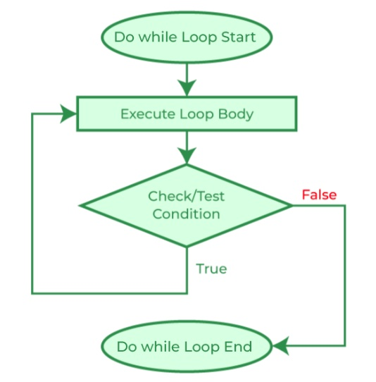

.. index:: statement; do while
   do while 
   while vs. do while
   
.. _do-while:

Do-While Loops
=================

The general form of a |do-while| statement (referred to as the "``do`` statement" in 
the C# language reference [#do-statement]_) is:

.. code-block:: none
   :linenos:
   :emphasize-lines: 1

   initialization 

   do
   { 
         // statement(s)
         // iterator expression
   } while ( *condition* )``;``

The ``do-while`` loop is a variation of the ``while loop``. The ``do`` statement executes 
a statement or a block of statements, followed by a Boolean expression to decide the 
continuation of the iteration. Because that expression is evaluated **after** each execution 
of the loop, a do loop executes **one or more** times. The ``do`` loop differs 
from the *while* loop, which executes *zero or more* times.

Compare the ``do-while`` general syntax with the ``while`` loop below and you should 
see clearly the difference in logic. 

.. code-block:: 
   :linenos:
   :emphasize-lines: 1

   initialization 

   while ( *condition* )
   { 
         // statement(s)
         // iterator expression
   }

In a ``while`` loop, if the condition evaluates to false from 
the very beginning, the body of statements will not be executed at all. 
In a ``do-while`` statement, the body statement(s) is *always* executed at least 
once, then the iteration continues if the followed condition tested true. 
This logic can be seen in the flowchart:

As a comparison, the while and do-while loops differ in several ways:

.. list-table:: while vs do-while
    :widths: 10 45 45 
    :header-rows: 1

    * - Feature
      - while
      - do-while
    * - Condition
      - checked before body statement is executed.
      - checked after body statement is executed.
    * - Body statement
      - may be executed zero times.
      - is executed at least once.
    * - Semicolon
      - no semicolon at the end of loop header. while(condition)
      - semicolon at the end of loop header. while(condition);
    * - Loop Variable
      - initialized before the execution of loop.
      - initialized before or within the loop.
    * - Control
      - entry-controlled.
      - exit-controlled.
    * - Syntax: 
      - while(condition) { statement(s); }
      - do { statement(s); } while(condition);

To get familiar with the do-while loop syntax, you should practice the following code 
in ``csharprepl``::

    > int n = 0;  do 
      { 
          Console.Write(n); 
          n++; 
      } while (n < 5); 

    // output: 01234
    >

``do-while`` Example: Right Triangle
-------------------------------------

Suppose you want the user to enter three integers for sides of a 
right triangle. If they do not make a right triangle, say so
and make the user try again.

One way to look at the while statement rubric is:

.. code-block:: none

    set data for condition
    while (condition) {
       accomplish something
       set data for condition
    }

**Using input methods in the UI class**
In this example, you will solicit user input for three times. While you may do so by 
using three Console.Write() and Console.ReadLine() lines to save the user input data, 
you may also try using the customized user input methods in the UI class (for how to use 
the methods, see :ref:`the_ui_class`). 

In cases like this, we would like to intake user data, perform certain operations 
to the data that are too complicated for the while header condition, then make the 
decision about the iteration. A |do-while| loop works better because we want to 
collect user input first, perform some calculation, before we tell the user that 
their input is correct or not:

.. code-block:: csharp

    int a, b, c;
    do {
        Console.WriteLine("Think of integer sides for a right triangle.");
        a = UI.PromptInt("Enter integer leg: ");
        b = UI.PromptInt("Enter another integer leg: ");
        c = UI.PromptInt("Enter integer hypotenuse: ");
        if (a*a + b*b != c*c) {
            Console.WriteLine("Not a right triangle: Try again!");
        }
    } while (a*a + b*b != c*c);
    

.. note::

   A |do-while| loop is the *one* place where you *do* want a semicolon
   right after a condition, unlike the places mentioned in
   :ref:`dangerous-semicolon`.  At least if you omit it here you
   are likely to get a compiler error rather than a difficult logical
   bug.

A |do-while| loop, like the example above, 
can accomplish exactly the same thing as the ``while``
loop rubric at the beginning of this section.  It has the general form:

.. code-block:: none

    do {
       set data for condition
       if (condition) {
           accomplish something
       }
    } while (condition);

In the example above note that the declaration of ``a``, ``b``, and ``c`` is 
*before* the |do-while|
loop. You can try moving the declaration inside the braces for the loop body,
and see the compiler error that you get!  

.. note::
   Recall the variables declared inside
   a braces-delimited block have scope *local to that block*. The condition at 
   the end of the loop is *outside* that scope. Hence the declaration of variables that
   you want in the final test or for later use after the loop must be 
   declared *before* the |do-while| loop.

.. rubric:: Footnotes

.. [#do-statement] See: `C# Language Reference <https://learn.microsoft.com/en-us/dotnet/csharp/language-reference/language-specification/statements#1393-the-do-statement>`_